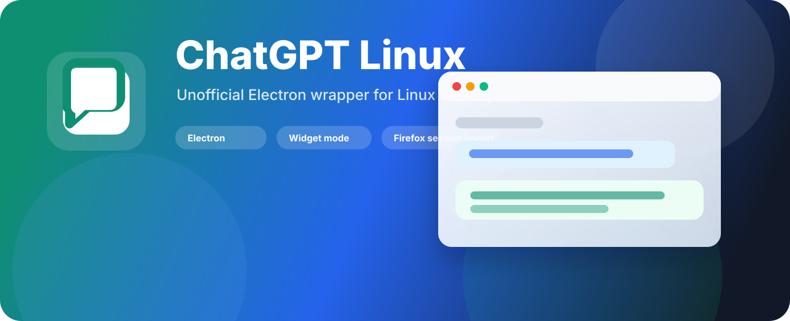
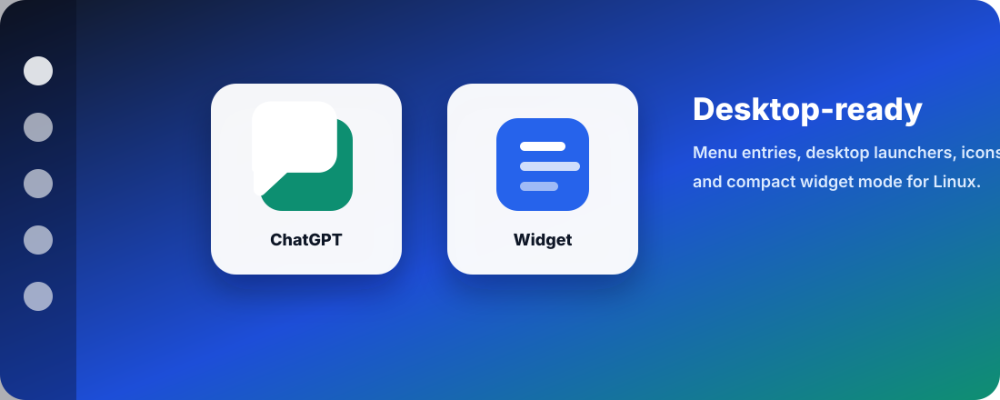

<p align="center">
  
</p>

<p align="center">
  <a href="https://github.com/BlackSnaker/ChatGPTLinux/actions/workflows/release.yml"></a>
  <a href="https://github.com/BlackSnaker/ChatGPTLinux/releases"></a>
  <a href="LICENSE"></a>
  
</p>

<p align="center">
  <b>Русский</b> · <a href="#english">English</a>
</p>

# ChatGPT Linux

Неофициальное Linux-приложение для `https://chatgpt.com` на Electron.

Проект делает ChatGPT удобным desktop-приложением для Linux: отдельное окно,
компактный виджет поверх окон, ярлыки в меню/на рабочем столе и импорт уже
существующей ChatGPT/OpenAI-сессии из Firefox.

> Проект не связан с OpenAI. ChatGPT и OpenAI являются товарными знаками OpenAI.
> Иконка в репозитории намеренно нейтральная.

## Возможности

- Полноразмерное Electron-окно с `chatgpt.com`.
- Компактный режим `--widget`: настоящий ChatGPT в маленьком закрепленном окне.
- Отдельный профиль Electron, чтобы не смешивать данные с браузером.
- Импорт non-expired cookies для `chatgpt.com`, `openai.com`, `auth0.com` из Firefox.
- Скрипт установки ярлыков для меню приложений и рабочего стола.
- GitHub Actions release workflow с готовым `linux-unpacked.tar.gz`.

<p align="center">
  
</p>

## Виджет

Виджет — это не отдельная форма и не фейковый prompt launcher. Это тот же
`chatgpt.com`, но в компактном Electron-окне, закрепленном поверх остальных
окон.

<p align="center">
  
</p>

Запуск виджета из исходников:

```bash
npm run start:widget
```

Запуск виджета из unpacked-сборки:

```bash
./dist/linux-unpacked/chatgpt-linux --widget
```

## Установка

Скачайте архив из [Releases](https://github.com/BlackSnaker/ChatGPTLinux/releases),
распакуйте его и запустите:

```bash
./linux-unpacked/chatgpt-linux
```

Для установки ярлыков в меню приложений и на рабочий стол:

```bash
bash scripts/install-desktop.sh /absolute/path/to/linux-unpacked/chatgpt-linux
```

После установки появятся два ярлыка:

- `ChatGPT` — обычное окно.
- `ChatGPT Widget` — компактное окно поверх остальных.

<p align="center">
  
</p>

## Разработка

```bash
npm ci
npm run check
npm start
```

Локальная сборка:

```bash
npm run pack
npm run dist:linux
```

CI-сборка без AppImage:

```bash
npm run dist:ci
```

## Импорт сессии из Firefox

Google может блокировать вход через OAuth внутри Electron, потому что Electron
считается embedded browser. Практичный сценарий:

1. Войти в `https://chatgpt.com` в Firefox.
2. Запустить ChatGPT Linux.
3. Приложение импортирует non-expired cookies для ChatGPT/OpenAI/Auth0 в
   Electron-профиль.

Значения cookies не печатаются. Временная копия `cookies.sqlite` удаляется
сразу после импорта.

Выбрать конкретный Firefox-профиль:

```bash
CHATGPT_FIREFOX_PROFILE=/absolute/path/to/profile npm start
```

Отключить импорт:

```bash
CHATGPT_DISABLE_FIREFOX_IMPORT=1 npm start
```

## Описание для GitHub About

```text
Unofficial ChatGPT desktop wrapper for Linux with compact widget mode, desktop launchers, and Firefox session import.
```

Рекомендуемые topics:

```text
chatgpt, electron, linux, desktop-app, widget, appimage, openai
```

---

<a id="english"></a>

# ChatGPT Linux

Unofficial Electron wrapper for `https://chatgpt.com` on Linux.

This project packages ChatGPT as a Linux desktop app: a full-size app window,
a compact always-on-top widget, desktop launchers, and optional Firefox session
import for users who prefer completing Google login in a regular browser.

> This project is not affiliated with OpenAI. ChatGPT and OpenAI are trademarks
> of OpenAI. The repository icon is intentionally generic.

## Highlights

- Full-size Electron window for `chatgpt.com`.
- Compact `--widget` mode with the real ChatGPT web app.
- Separate Electron profile for app data.
- Firefox session import for `chatgpt.com`, `openai.com`, and `auth0.com`.
- Desktop integration script for app menu entries and desktop launchers.
- GitHub Actions release workflow with `linux-unpacked.tar.gz` artifacts.

## Install

Download the archive from [Releases](https://github.com/BlackSnaker/ChatGPTLinux/releases),
extract it, then run:

```bash
./linux-unpacked/chatgpt-linux
```

Install Linux menu and desktop launchers:

```bash
bash scripts/install-desktop.sh /absolute/path/to/linux-unpacked/chatgpt-linux
```

## Development

```bash
npm ci
npm run check
npm start
```

Start widget mode:

```bash
npm run start:widget
```

Build artifacts:

```bash
npm run pack
npm run dist:linux
```

## Firefox Session Import

Google can block OAuth inside Electron because Electron is treated as an
embedded browser. Recommended flow:

1. Sign in to `https://chatgpt.com` in Firefox.
2. Start ChatGPT Linux.
3. The app imports non-expired ChatGPT/OpenAI/Auth0 cookies into the Electron
   profile.

Cookie values are not printed. The temporary `cookies.sqlite` copy is deleted
after import.

Disable import:

```bash
CHATGPT_DISABLE_FIREFOX_IMPORT=1 npm start
```

## Release

GitHub Actions builds Linux artifacts on pushes, pull requests, and version
tags. To publish a release:

```bash
git tag v1.0.0
git push origin main --tags
```

The release workflow uploads `linux-unpacked.tar.gz`. Local AppImage builds are
available through:

```bash
npm run dist:linux
```

